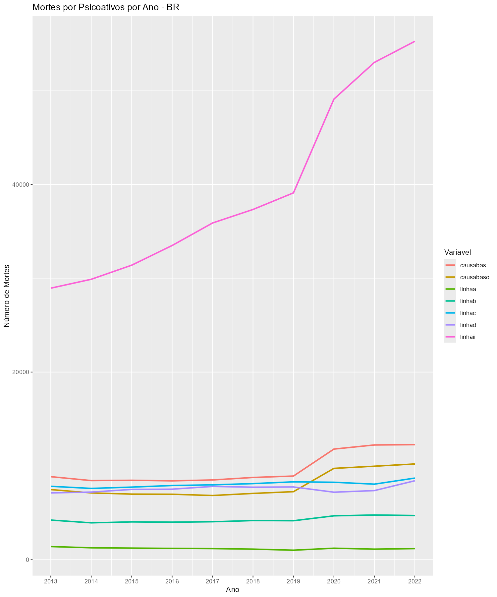
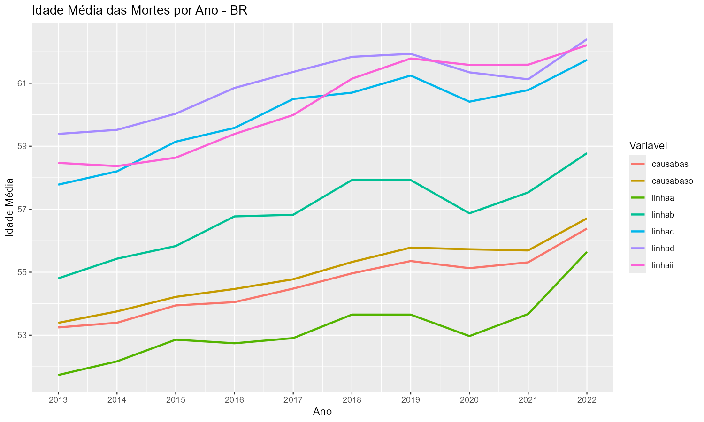
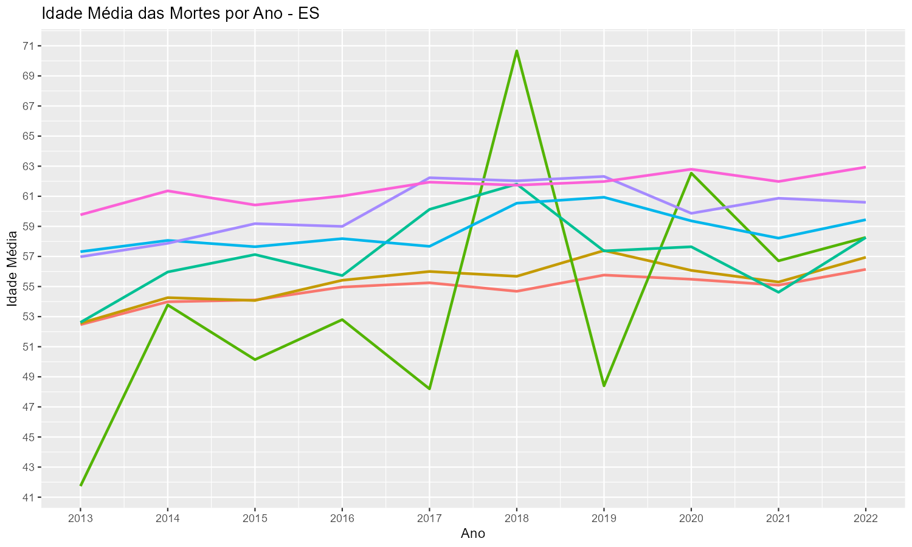
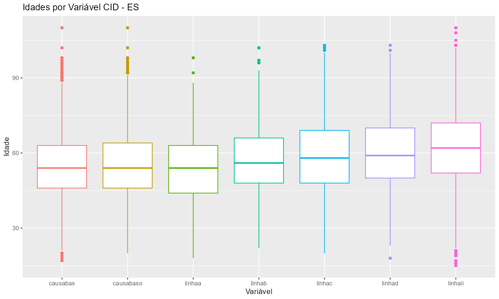
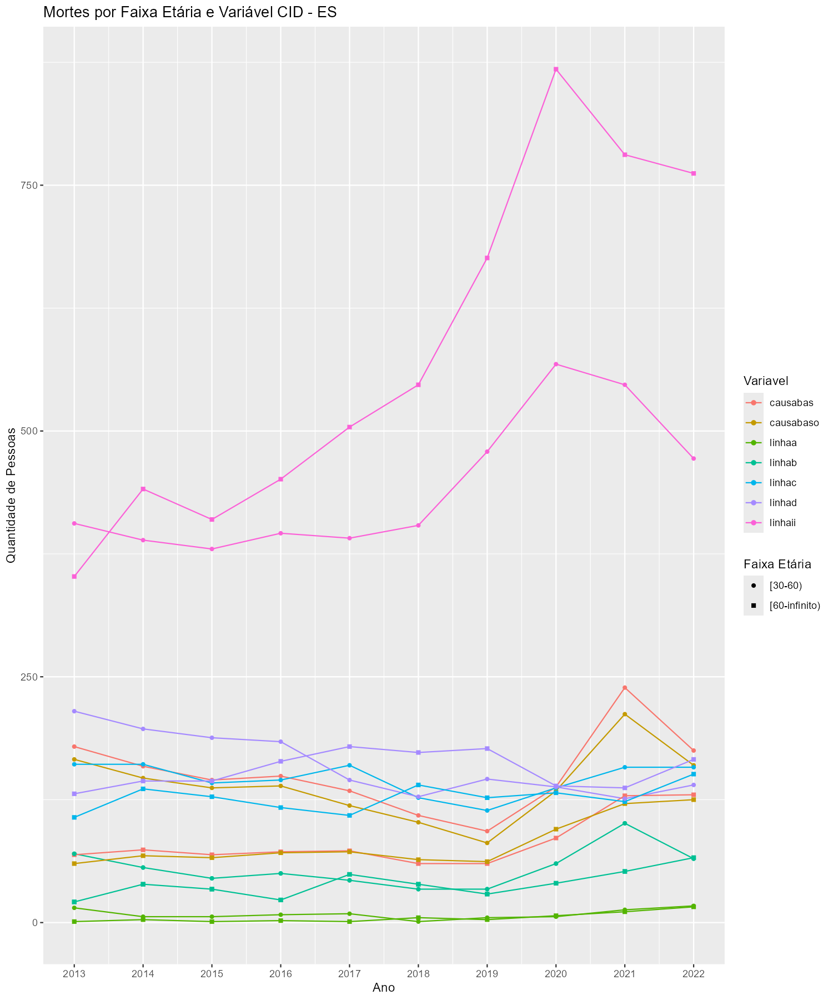
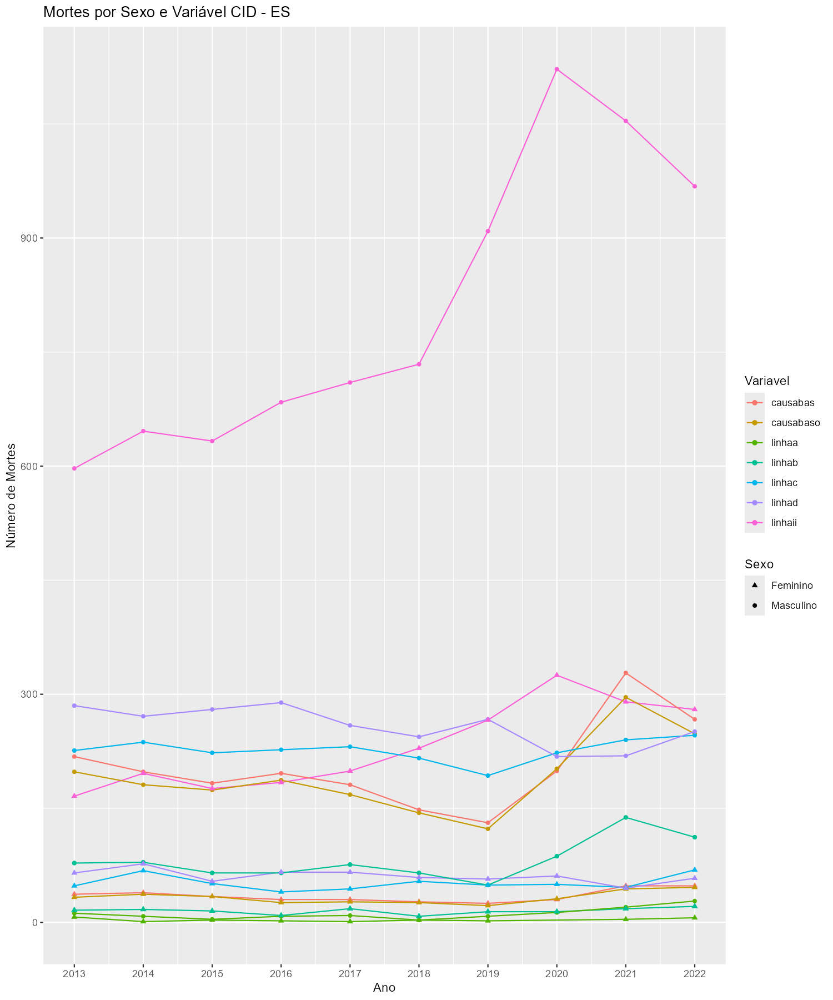
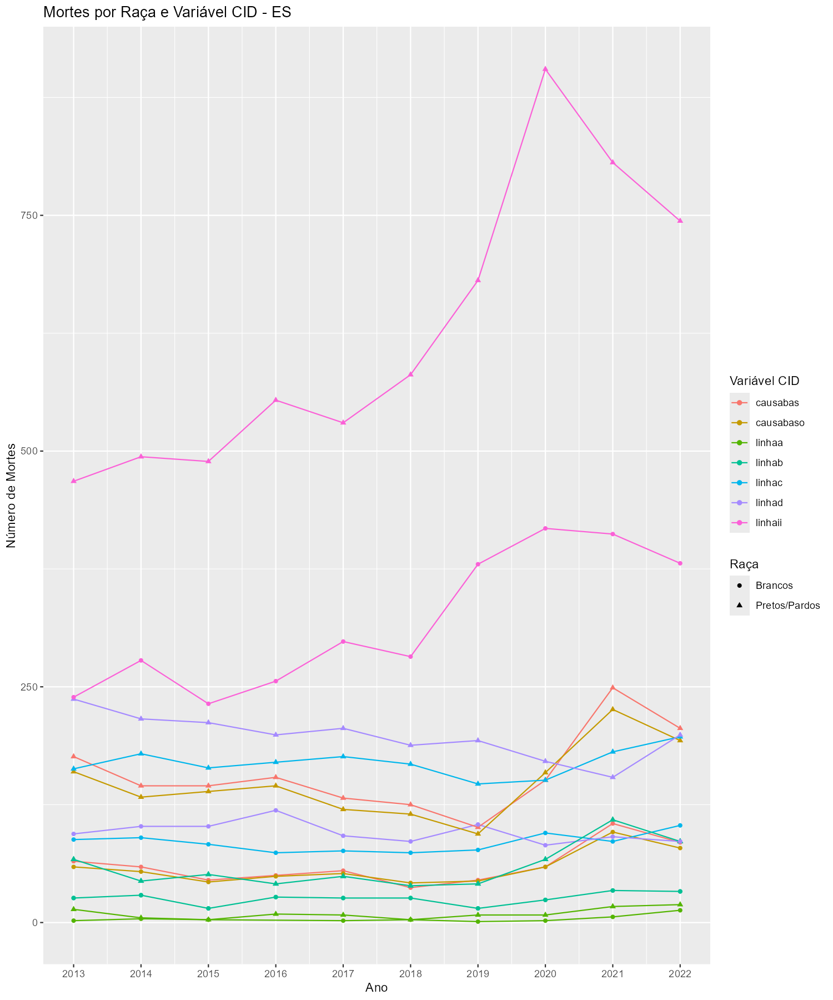

```{r setup, include=FALSE}
knitr::opts_chunk$set(echo = TRUE)
```

```{r, echo=FALSE, message=FALSE, warning=FALSE}
library(dplyr)
library(DT)
```

```{r, echo=FALSE, message=FALSE, warning=FALSE}
df_na_porcentagem <- read.csv("graficos_comparacao/na_porcentagem_por_ano.csv")
df_na_porcentagem_es <- read.csv("graficos_comparacao/na_porcentagem_por_ano_es.csv")
```

<br>

## 1. Introdução

<br>

Esta análise tem como objetivo explorar as informações das variáveis do SIM que contêm dados de CID's. Inicialmente, foram selecionadas as seguintes variáveis: ATESTADO, CAUSABAS_O, CB_PRE, LINHAA, LINHAB, LINHAC, LINHAD e LINHAII. Entretanto, observou-se que a variável CB_PRE continha apenas valores NA e que a variável ATESTADO não estava presente em todos os anos da análise. Por esses motivos, ambas as variáveis foram excluídas da análise. A seguir, são apresentadas as definições de cada uma das variáveis analisadas para uma melhor compreensão de cada uma delas.

<br>
**CAUSABAS**: Causa básica da DO;  
CAUSABAS_O: Causa básica informada antes da seleção. (Códigos CID 10);    
**LINHAA**: CIDs informados na Linha A da DO referente ao diagnóstico na Linha A da DO (causa terminal - doença ou estado mórbido que causou diretamente a morte). (Códigos CID 10);  
**LINHAB**: CIDs informados na Linha B da DO referente ao diagnóstico na Linha B da DO (causa antecedente ou consequencial - estado mórbido, se existir, que produziu a causa direta da morte registrada na linha A). (Códigos CID 10);  
**LINHAC**: CIDs informados na Linha C da DO referente ao diagnóstico na Linha C da DO (causa antecedente ou consequencial - estado mórbido, se existir, que produziu a causa direta da morte registrada na linha A). (Códigos CID 10);  
**LINHAD**: CIDs informados na Linha D da DO referente ao diagnóstico na Linha D da DO (causa básica - estado mórbido, se existir, que produziu a causa direta da morte registrada na linha A). (Códigos CID 10);  
**LINHAII**: CIDs informados na Parte II da DO referente ao diagnóstico na Parte II da DO (causa contribuinte - outras condições significativas que contribuíram para a morte e que não entraram na cadeia definida na Parte I). (Códigos CID 10).

Como pode ser visto, as variáveis LINHAA, LINHAB, LINHAC e LINHAD descrevem uma cadeia que causou o óbito, sendo LINHAD o início dessa cadeia e LINHAA a parte final. Além disso, a variável LINHAII diz respeito a um fator que também contribuiu para a morte, mas que não está diretamente relacionado com essa cadeia que levou ao óbito.

<br>

## 2. Quantidade de Dados e de Mortes de acordo com cada Variável

<br>

Para começar a análise de dados das variáveis referentes às CIDs, precisamos primeiramente entender qual é o volume de dados que temos ao filtrar o uso de psicoativos pelas CIDs. Em outras palavras, precisamos saber quantas linhas os data frames de cada variável possuem após filtrarmos os dados por uso de psicoativos.

<br>

```{r, echo=FALSE, fig.show='hold', out.width="48%"}
knitr::include_graphics("graficos_comparacao/obs_por_variavel.png")

```

<br>

Através dos gráficos, é possível perceber que tanto no estado do Espírito Santo quanto no Brasil, o número de óbitos em que os psicoativos foram contribuintes, mas não entraram na cadeia principal do óbito (circunstância representada pela variável LINHAII), é aproximadamente quatro vezes maior que nas demais situações explicitadas nesta análise.

Esse dado é importante tanto para entender as informações que serão apresentadas a seguir quanto para compreender como as drogas interferem na saúde da população. Como o número de mortes que apresentaram o uso de psicoativos como uma causa contribuinte é superior ao das demais, é esperado que, em todas as demais análises, os números vinculados à variável LINHAII sejam superiores aos das demais variáveis CID. Além disso, o gráfico fornece uma informação muito importante: os psicoativos são muitas vezes contribuintes das mortes, mas não parte da cadeia principal que ocasionou o óbito.

Ao comparar o número de observações do Brasil e do Espírito Santo, é notório também que, no estado, o número de casos em que o uso de psicoativos está na parte mais inicial da cadeia de morte (LINHAD e LINHAC) é superior ao número de casos nas partes finais da cadeia (LINHAB e LINHAA), enquanto no país, LINHAB é superior a LINHAC e LINHAD. Em ambos, o número de mortes por psicoativos que foi a causa terminal da morte é significativamente baixo.

No gráfico a seguir, é possível ver o número de mortes por psicoativos entre os anos de 2013 e 2022. É interessante observar que "Número de Observações" e "Número de Mortes" dizem respeito ao mesmo dado. Nesta análise, optamos por nomes diferentes, pois gostaríamos de mostrar tanto o tamanho das bases de dados analisadas quanto os dados que elas representam.


<br>

```{r, echo=FALSE, fig.show='hold', out.width="48%"}


```

<br>

No gráfico de mortes por psicoativos no Brasil, é possível perceber que os óbitos por psicoativos explicitados em CAUSABAS e CAUSABAS_O permaneceram constantes até 2019, cresceram em 2020 e voltaram a se estabilizar no mesmo patamar de 2020. Os apresentados em LINHAII cresceram em todos os anos, com ênfase em 2020, quando a inclinação da linha foi ainda maior que nos demais anos. As mortes por uso de drogas exibidas nas demais variáveis se mantiveram praticamente constantes durante todos os anos. Nesse sentido, tendo como objetivo investigar um aumento no número de óbitos por psicoativos, pode ser interessante focar na variável LINHAII.

No que diz respeito aos dados referentes ao estado do Espírito Santo, é possível notar uma maior variação nas curvas de cada variável CID. Entretanto, é importante considerar que o tamanho da base de dados do estado é inferior ao do país, e essa diferença pode estar ocasionando essas variações. De modo geral, CAUSABAS e CAUSABAS_O também exibem um aumento significativo em 2020. No caso do estado, a curva era decrescente até 2019, cresce em 2020 e continua a crescer até 2021. LINHAII é a única variável que apresenta um gráfico crescente nos anos anteriores a 2019.

<br>

## 3. Idade de Faixa Etária

<br>

A primeira variável sociodemográfica a ser discutida será a idade. Para essa análise, foi considerada a data do óbito subtraída da data de nascimento, e os meses foram descartados, ou seja, foram considerados apenas anos completos. O primeiro gráfico a ser analisado é o de média de mortes por psicoativos no Brasil e no Espírito Santo entre os anos de 2013 e 2022, de acordo com cada variável CID.

<br>

```{r, echo=FALSE, fig.show='hold', out.width="48%"}


```

<br>

Inicialmente, a primeira característica que chama atenção nos gráficos é a diferença entre o gráfico do país e o gráfico do estado, principalmente no que diz respeito aos dados de LINHAA. Nele, a média de idade das pessoas que morreram por uso de psicoativos varia de aproximadamente 42 anos em 2013 para 71 anos em 2018. Nos mesmos anos, as idades médias de óbito por psicoativo no Brasil em LINHAA foram de aproximadamente 52 e 54 anos, respectivamente. As demais variáveis CID parecem mais estáveis. Mais informações podem ser observadas nos gráficos boxplot.

<br>

```{r, echo=FALSE, fig.show='hold', out.width="48%"}
knitr::include_graphics("graficos_comparacao/boxplot_idades_por_variavel.png")

```

<br>

Através do boxplot, é possível visualizar a média de idade dos óbitos que ocorreram, de alguma maneira, devido ao ou como consequência do uso de psicoativos. Os gráficos abrangem dados de uma década (2013-2022).

É possível perceber que a distância entre o primeiro e o terceiro quartil nos dados referentes ao Espírito Santo é, em geral, maior do que nos dados do Brasil. Isso pode indicar que as idades das mortes são mais dispersas e apresentam maior variação, o que também foi sugerido na análise do gráfico de Idade Média das Mortes por Ano.

Além disso, as linhas de mediana no gráfico do Brasil são mais centrais quando comparadas às linhas de mediana do gráfico do Espírito Santo. Isto é, as idades abaixo e acima da mediana são mais equilibradas no Brasil e mais discrepantes no Espírito Santo.

<br>

```{r, echo=FALSE, fig.show='hold', out.width="48%"}
knitr::include_graphics("graficos_comparacao/grafico_series_faixaeta.png")

```

<br>

Outra forma de analisar a idade é através de faixas etárias. Para este relatório, os dados foram agrupados em [0-18), [18-30), [30-60) e [60-infinito), descrevendo a idade das crianças/adolescentes, jovens adultos, adultos e idosos, respectivamente. Como o número de mortes por psicoativos de pessoas com menos de 18 anos foi muito baixo, optamos por mostrar apenas as linhas referentes aos grupos de adultos e idosos, priorizando assim uma melhor visualização do gráfico.

No Brasil, as variáveis CAUSABAS, CAUSABAS_O, LINHAA e LINHAB registraram mais mortes de adultos do que de idosos. Todas essas variáveis estão relacionadas ao uso de substâncias como um fator mais determinante na morte. LINHAC e LINHAD, que seriam as próximas variáveis na escala de relevância dos psicoativos para a morte, oscilam entre as faixas etárias. LINHAII, a variável na qual o uso de psicoativos é apenas um contribuinte e não está presente na cadeia definida de morte, é a única em que o grupo dos idosos tem mais ocorrências do que o grupo dos adultos. Esses dados nos levam a crer que possa existir uma relação entre mortes mais precoces e o uso de substâncias como causa principal do óbito.

No Espírito Santo, CAUSABAS e CAUSABAS_O têm os adultos como maioria das mortes. LINHAA, LINHAB, LINHAC e LINHAD variam ao longo do tempo. LINHAII é novamente a única que tem os idosos como a maioria dos óbitos em praticamente todos os anos.

<br>


## 4. Sexo e Raça

<br>

Os dados de raça apresentaram uma quantidade significativa de dados faltantes (NA's). Portanto, para qualquer análise realizada nesta seção, é importante considerar o grau de incerteza decorrente desses NA's. Os números exatos e porcentagens de NA's, tanto do Brasil quanto do Espírito Santo, podem ser vistos nas tabelas da seção 6.

Além disso, as raças/cores preta e parda foram agrupadas para facilitar a visualização do gráfico.

<br>

```{r, echo=FALSE, fig.show='hold', out.width="48%"}
knitr::include_graphics("graficos_comparacao/grafico_series_genero.png")

```

<br>

O gráfico de Mortes por Sexo e Variável CID mostra que, em todas as variáveis, o número de mortes foi significativamente maior entre os homens, tanto no Brasil quanto no Espírito Santo.

<br>

```{r, echo=FALSE, fig.show='hold', out.width="48%"}
knitr::include_graphics("graficos_comparacao/grafico_series_raca.png")

```

<br>

Ao somar pretos e pardos, o número de mortes dessa raça/cor é superior ao da raça/cor branca em todas as variáveis analisadas e segue padrões muito semelhantes aos apresentados no gráfico de séries de Mortes por Psicoativos por Ano.

<br>

## 5. Dados 

<br>

Além da variável Raça conter um número bastante elevado de NA's, Estado Civil e Escolaridade também apresentaram muitos dados faltantes. No caso dessas duas últimas informações sociodemográficas, optamos por retirá-las devido à falta de dados, especialmente no estado do Espírito Santo, e pela dificuldade de visualização dos gráficos, já que para cada variável do CID seria necessário plotar no mínimo três linhas.

As tabelas a seguir permitem aplicar filtros para que seja possível ver a quantidade e porcentagem de dados faltantes em cada ano, para cada variável sociodemográfica e cada variável CID. É importante mencionar que o número máximo de dados faltantes no Brasil foi de 26,43%, encontrado nos dados de Escolaridade da LINHAA. No Espírito Santo, a máxima foi de 47,57%, também em Escolaridade na LINHAA.

<br>

```{r, echo=FALSE, out.width="80%", fig.align="center"}
df_na_porcentagem <- df_na_porcentagem %>%
  rename(
    `Ano do óbito` = ANOOBITO,
    `Nº de Casos` = Total_Casos,
    `Nº de NAs` = Total_NA,
    `% de NAs` = Porcentagem_NA,
    `Variável do CID` = Variavel_CID,
    `Variável Sociodemográfica` = Var_Sociodemo
  ) %>%
  mutate(`% de NAs` = round(`% de NAs`, 2)) 

datatable(
  df_na_porcentagem,
  filter = 'top',  # Adiciona filtros no topo de cada coluna
  options = list(pageLength = 10),  # Mostra 10 linhas por página
  caption = 'Brasil: Porcentagem de Dados NA por Ano, Variável do CID e Variável Sociodemográfica'
)
```

<br><br>

```{r, echo=FALSE, out.width="80%", fig.align="center"}
df_na_porcentagem_es <- df_na_porcentagem_es %>%
  rename(
    `Ano do óbito` = ANOOBITO,
    `Nº de Casos` = Total_Casos,
    `Nº de NAs` = Total_NA,
    `% de NAs` = Porcentagem_NA,
    `Variável do CID` = Variavel_CID,
    `Variável Sociodemográfica` = Var_Sociodemo
  ) %>%
  mutate(`% de NAs` = round(`% de NAs`, 2)) 

datatable(
  df_na_porcentagem_es,
  filter = 'top',  # Adiciona filtros no topo de cada coluna
  options = list(pageLength = 10),  # Mostra 10 linhas por página
  caption = 'Espírito Santo: Porcentagem de Dados NA por Ano, Variável do CID e Variável Sociodemográfica'
)
```


<br>

## 6. Próximos Passos

<br>

i. Revisar a compreensão das variáveis do SIM.
ii. Dentro dos casos de mortes por psicoativos explicitados na LINHAII, investigar qual foi a causa básica da morte, ou seja, as CIDs presentes em CAUSABAS.
iii. Investigar mais detalhadamente a relação entre a idade do óbito e o grau de importância que o uso de psicoativos teve na morte.


<br>
