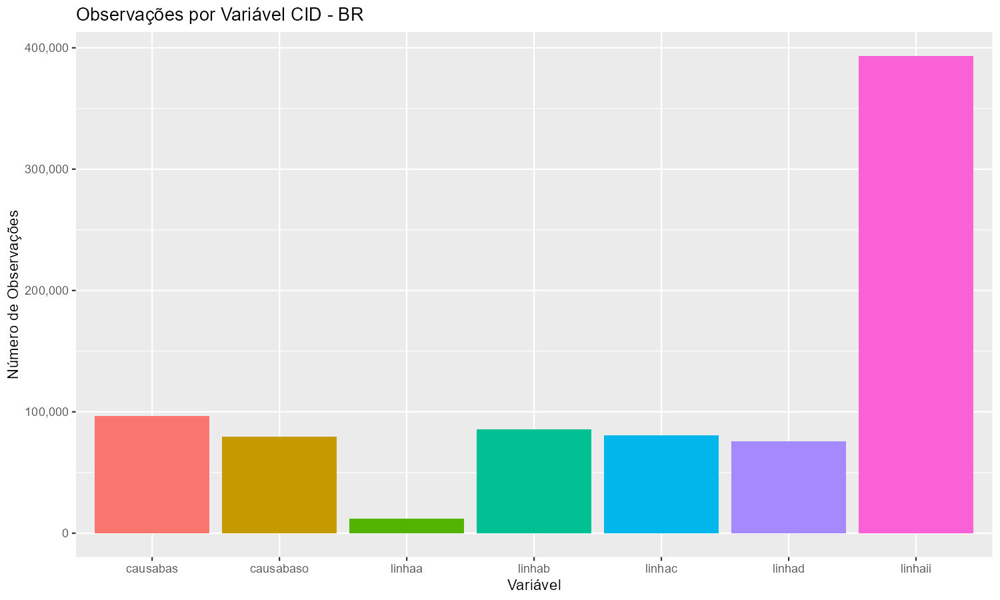
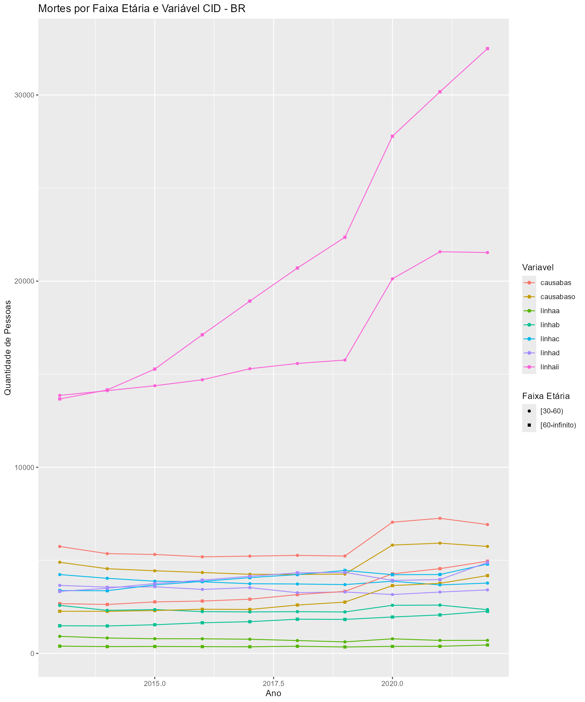
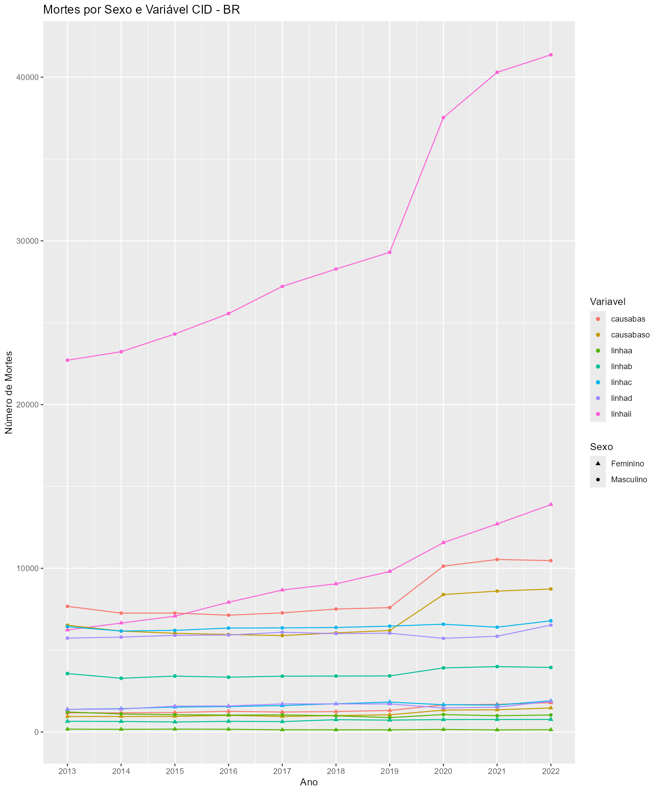
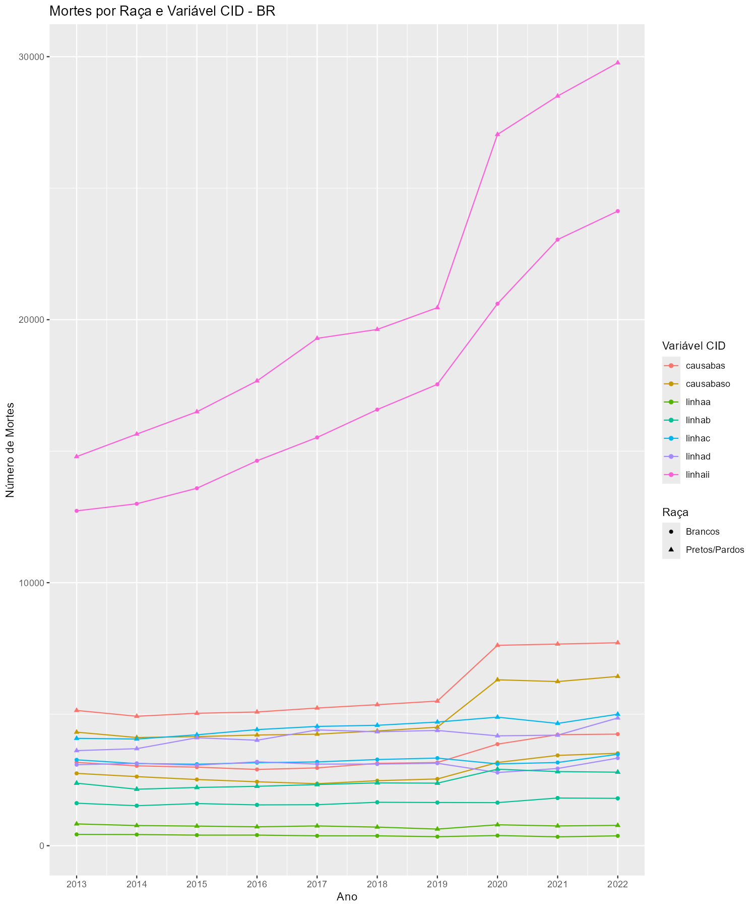

```{r setup, include=FALSE}
knitr::opts_chunk$set(echo = TRUE)
```

```{r, echo=FALSE, message=FALSE, warning=FALSE}
library(dplyr)
library(DT)
```

```{r, echo=FALSE, message=FALSE, warning=FALSE}
df_na_porcentagem <- read.csv("graficos_comparacao/na_porcentagem_por_ano.csv")
```

<br>

## 1. Introdução

<br>

Esta análise tem como objetivo explorar as informações das variáveis do SIM que contêm dados dos CID's. Inicialmente foram selecionadas as seguintes variáveis: ATESTADO, CAUSABAS_O, CB_PRE, LINHAA, LINHAB, LINHAC, LINHAD e LINHAII. Entretanto, observou-se que a variável CB_PRE continha apenas valores NA, e que a variável ATESTADO não estava presente em todos os anos da análise. Por esses motivos, ambas as variáveis foram excluídas da análise. A seguir, são apresentadas as definições de cada uma das variáveis analisadas para uma melhor compreensão de cada uma delas.  

<br>

**CAUSABAS**: Causa básica da DO. (Códigos CID 10);    
**CAUSABAS_O**: Causa básica informada antes da resseleção. (Códigos CID 10);  
**LINHAA**: CIDs informados na Linha A da DO referente ao diagnóstico na Linha A da DO (causa terminal - doença ou estado mórbido que causou diretamente a morte). (Códigos CID 10);  
**LINHAB**: CIDs informados na Linha B da DO referente ao diagnóstico na Linha B da DO (causa antecedente ou conseqüencial - estado mórbido, se existir, que produziu a causa direta da morte registrada na linha A). (Códigos CID 10);  
**LINHAC**: CIDs informados na Linha C da DO referente ao diagnóstico na Linha C da DO (causa antecedente ou conseqüencial - estado mórbido, se existir, que produziu a causa direta da morte registrada na linha A). (Códigos CID 10);  
**LINHAD**: CIDs informados na Linha D da DO referente ao diagnóstico na Linha D da DO (causa básica – estado mórbido, se existir, que produziu a causa direta da morte registrada na linha A). (Códigos CID 10);  
**LINHAII**: CIDs informados na Parte II da DO referente ao diagnóstico na Parte II da DO (causa contribuinte - outras condições significativas que contribuíram para a morte e que não entraram na cadeia definida na Parte I). (Códigos CID 10);  

<br>

## 2. Quantidade de Dados e de Mortes de acordo com cada Variável

<br>

Para começar a análise de dados das variáveis referentes às CIDs, precisamos primeiramente entender qual é o volume de dados que temos ao filtrarmos o uso de psicoativos pelas CIDs. Em outras palavras, precisamos saber quantas linhas os data frames de cada variável possuem após filtrarmos os dados por uso de psicoativos.

Para termos uma medida de comparação, tomaremos a variável CAUSABAS como padrão, pois ela é considerada a causa básica do óbito.

<br>

```{r, echo=FALSE, out.width="80%", fig.align="center"}

```

<br>

```{r, echo=FALSE, out.width="80%", fig.align="center"}
knitr::include_graphics("graficos_comparacao/mortes_por_variavel.png")
```

<br>

Através dos gráficos, é possível perceber que as variáveis LINHAA e LINHAII possuem uma discrepância em relação às demais no que diz respeito à quantidade de ocorrências. LINHAA possui um número de ocorrências menor que CAUSABAS. Essa variável trata das causas terminais, isto é, da doença ou estado mórbido que causou diretamente a morte.

Em contrapartida, LINHAII teve quase 400 mil observações, enquanto as demais variáveis não atingiram nem 100 mil observações. A variável em questão trata de causas contribuintes, que são entendidas como "outras condições significativas que contribuíram para a morte e que não entraram na cadeia definida na Parte I".

Essa análise pode indicar como os psicoativos colaboram para o estado que leva ao óbito. Eles podem representar mais uma contribuição para a morte do que a causa principal, o que torna necessário investigar quais são os fatores principais relacionados a esses óbitos.

<br>

## 3. Idade de Faixa Etária

<br>

```{r, echo=FALSE, out.width="80%", fig.align="center"}
knitr::include_graphics("graficos_comparacao/idade_por_variavel.png")
```

<br>

```{r, echo=FALSE, out.width="80%", fig.align="center"}

```

<br>

```{r, echo=FALSE, out.width="80%", fig.align="center"}
knitr::include_graphics("graficos_comparacao/boxplot_idades_por_variavel.png")
```

<br>

## 4. Sexo e Raça

<br>

```{r, echo=FALSE, out.width="80%", fig.align="center"}

```

<br>

```{r, echo=FALSE, out.width="80%", fig.align="center"}

```

<br>

## 5. Dados NA

<br>

```{r, echo=FALSE, out.width="80%", fig.align="center"}
df_na_porcentagem <- df_na_porcentagem %>%
  rename(
    `Ano do óbito` = ANOOBITO,
    `Nº de Casos` = Total_Casos,
    `Nº de NAs` = Total_NA,
    `% de NAs` = Porcentagem_NA,
    `Variável do CID` = Variavel_CID,
    `Variável Sociodemográfica` = Var_Sociodemo
  ) %>%
  mutate(`% de NAs` = round(`% de NAs`, 2)) 

datatable(
  df_na_porcentagem,
  filter = 'top',  # Adiciona filtros no topo de cada coluna
  options = list(pageLength = 10),  # Mostra 10 linhas por página
  caption = 'Porcentagem de Dados NA por Ano, Variável do CID e Variável Sociodemográfica'
)
```


<br>

## 6. Próximos Passos

<br>

1. Dentro dos casos de mortes por psicoativos explicitados na LINHAII, investigar qual foi a causa básica da morte, isto é, as CIDs presentes em CAUSABAS.

<br>
